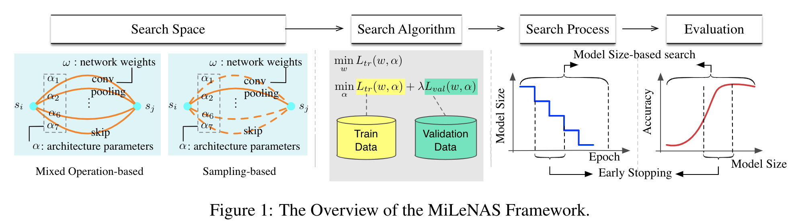

# MiLeNAS: Efficient Neural Architecture Search via Mixed-level Reformulation (CVPR'2020)
This is the source code for the following paper:
```
@inproceedings{he2020milenas,
  title={MiLeNAS: Efficient neural architecture search via mixed-level reformulation},
  author={He, Chaoyang and Ye, Haishan and Shen, Li and Zhang, Tong},
  booktitle={Proceedings of the IEEE/CVF Conference on Computer Vision and Pattern Recognition},
  pages={11993--12002},
  year={2020}
}
```



Arxiv link: https://arxiv.org/abs/2003.12238

## Installation
For Linux OS:

```
conda create --name milenas python=3
conda install pytorch torchvision torchaudio cudatoolkit=10.2 -c pytorch
pip install -r requirements.txt
```

For Macbook:

```
conda create --name milenas python=3
conda install pytorch torchvision torchaudio -c pytorch
pip install -r requirements.txt
```


NOTE: PyTorch > 1.0 is supported.

## Datasets
For CIFAR10, it will be automatically downloaded.
For ImageNet, please download it manually and set the path accordingly.

## Architecture Search
MiLeNAS:
```
CUDA_VISIBLE_DEVICES=0 ./search_algorithm/run_milenas.sh "0" 200003 1 50 "saved_models" 0.025 0.0003 2021 8
```

DARTS (2nd):
```
CUDA_VISIBLE_DEVICES=0 sh search_algorithm/run_darts.sh "0" 77700 1 1 50 8 "saved_models" 1 0
```

Single Level Optimization:
```
CUDA_VISIBLE_DEVICES=0 sh search_algorithm/run_single_level.sh "0" 77723 1 50 8 "saved_models" 0.025 2
```

GDAS:
```
CUDA_VISIBLE_DEVICES=0 sh search_algorithm/run_gdas.sh "0" 0.025 0.001 0.0003 8
```

MiLeNAS (2nd):
```
CUDA_VISIBLE_DEVICES=0 sh search_algorithm/run_milenas_2nd.sh "0" 307 1 1 50 8 "saved_models"
```

MiLeNAS + GDAS (this integration can largely save the memory cost and also accelerate the searching)
```
CUDA_VISIBLE_DEVICES=0 sh search_algorithm/run_milenas_and_gdas.sh "0" 0.025 0.001 0.0003 8
```

MiLeNAS run at the later phase of DARTS:
```
CUDA_VISIBLE_DEVICES=0 sh search_algorithm/run_milenas_later_phase_of_bilevel.sh "0" 77763 1 50 8 "saved_models" 0.025 0.0003 6
```

## Architecture Evaluation (Training the searched model from scratch)
To evaluate our best cells by training from scratch, run
```
# CIFAR-10
CUDA_VISIBLE_DEVICES=0 sh evaluation/run_eval_cifar10.sh "0" GDAS_MIXED_LEVEL2 6000 0.030 saved_models

# ImageNet
CUDA_VISIBLE_DEVICES=0 sh evaluation/run_eval_imagenet.sh "0" GDAS_MIXED_LEVEL2 6000 0.030 /home/chaoyanghe/sourcecode/dataset/cv/ImageNet
```
Please change:
 
1. the `--arch` in `evaluation/run_eval_imagenet.sh` and `evaluation/run_eval_cifar10.sh`, 'arch' is defined at `genotypes.py`
2. the ImageNet data path.


## Visualization
```
python visualization/visualize.py GDAS_MIXED_LEVEL2
```
where `GDAS_MIXED_LEVEL2` is the architecture defined in `genotypes.py`.

## Citation
If you use any part of this code in your research, please cite our paper:
```
@inproceedings{he2020milenas,
  title={MiLeNAS: Efficient neural architecture search via mixed-level reformulation},
  author={He, Chaoyang and Ye, Haishan and Shen, Li and Zhang, Tong},
  booktitle={Proceedings of the IEEE/CVF Conference on Computer Vision and Pattern Recognition},
  pages={11993--12002},
  year={2020}
}
```
We also published FedNAS, a neural architecture search method for federated deep learning, please also cite if it is related to your research:
```
@inproceedings{FedNAS,
  title={FedNAS: Federated Deep Learning via Neural Architecture Search},
  author={He, Chaoyang and Annavaram, Murali and Avestimehr, Salman},
  booktitle={CVPR 2020 Workshop on Neural Architecture Search and Beyond for Representation Learning},
  year={2020},
}
```
